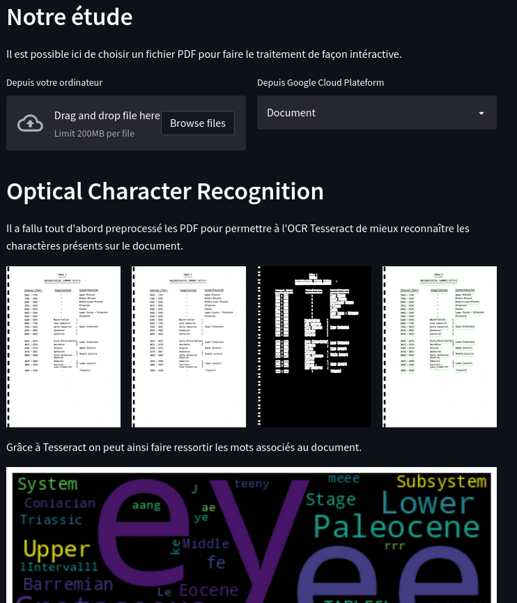
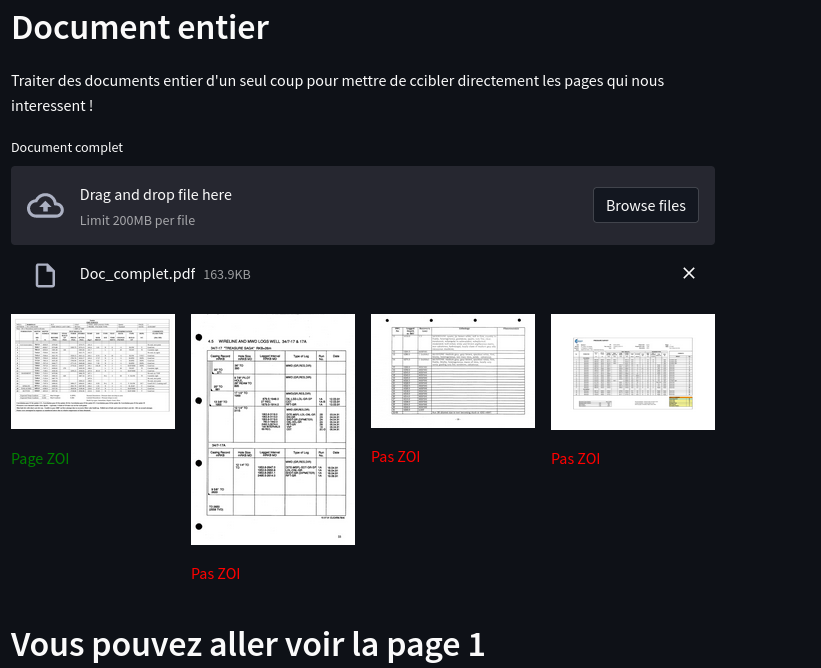

# IA PAU : Challenge 2022

Ce répertoire permet de présenter le code qui a permi de remporter le Data Challenge 2022. Il a été fait par l'équipe 911 constitué de Samuel YAO, Bertrand Carlos ADODO, Pierre VIRGAUX et Wael Saideni.

## Association 

L’association IA PAU rassemble dans la bonne humeur chercheurs, enseignants, étudiants, entrepreneurs, particuliers autour de la thématique du traitement des données et propose de rapprocher la sphère économique, le monde académique et le grand public en organisant des événements et des projets collaboratifs.

## Data Challenge

La rencontre entre d’une part une entreprise avec une problématique et un jeu de données, et d’autre part plusieurs équipes d’étudiants de toute la francophonie qui s’affrontent sous la tutelle des experts en data science de l’organisation. Pour plus d'information [ici](https://iapau.org/data-challenges/).

## Sujet proposé par Cap Gemini

En 2019, le site de Capgemini PAU a démarré un projet de R&D dont l’une des missions portait sur l’automatisation de la récupération des ZOI. Leur bonne détection est complexe mais primordiale car les données historiques sont rares et des données en moins entraînent une perte de précision dans les prédictions. A l’aide d’outils d’apprentissage supervisé et/ou non-supervisé, vous devrez proposer une solution afin de détecter si les documents pdf fournis en annexes contiennent ou non des ZOI. L’objectif final sera d’obtenir une solution qui dépassera les performances de la solution actuelle. Vous pouvez retrouver la vidéo de présentation [ici](https://www.youtube.com/watch?v=iSY-lrouMfc).

## Solution développé

### Traitements d'images

### Modèles

Vous pouvez retrouver le pitch final [ici](https://www.youtube.com/watch?v=rZlwlQNY2Ks).